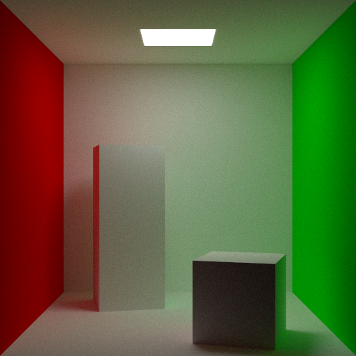
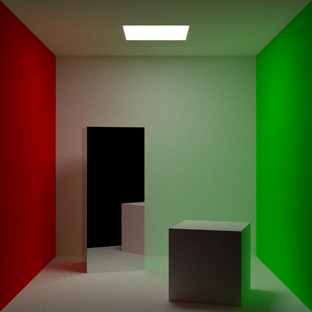
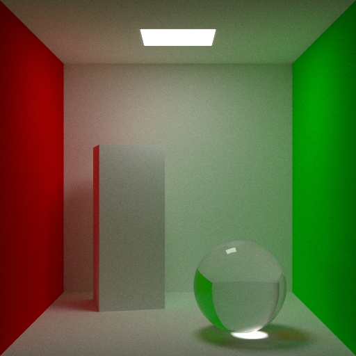
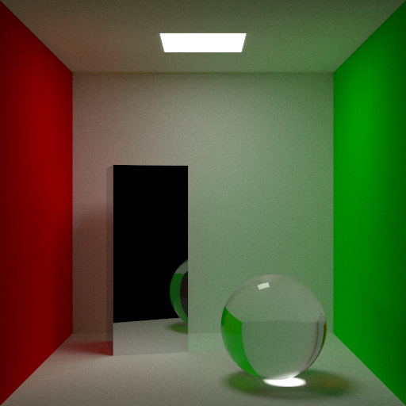

# Mote Carlo

## Example Renders
A few renders from the framework.

|                                                                                         |                                                                                                         |
|-----------------------------------------------------------------------------------------|---------------------------------------------------------------------------------------------------------|
|  Standard Cornell Box                          |  Cornell reflective pillar with cube                    |
|  Cornell pillar with glass sphere |  Cornell mirrored pillar with glass sphere |                         |

## Author
Simon Flannery
